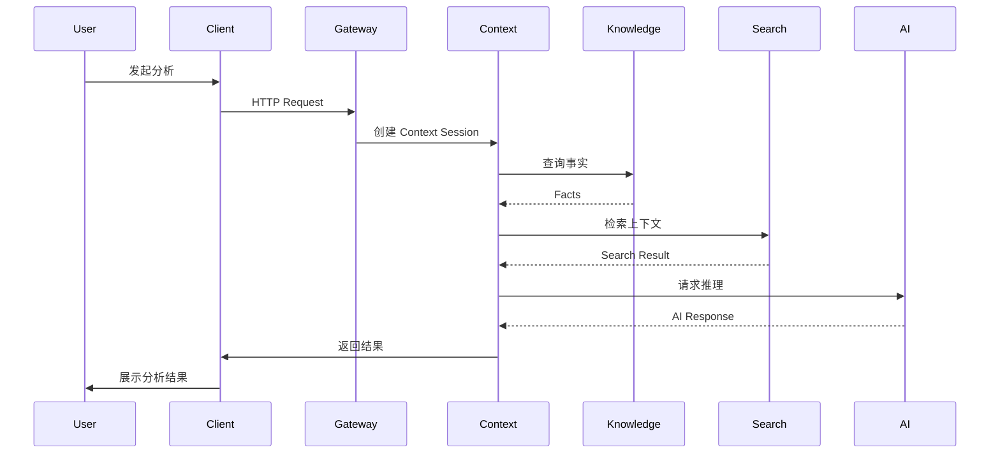

# 006 运行时架构（Runtime Architecture）

> **文档编号：** 006  
> **架构视图：** Runtime Architecture  
> **状态：** Draft  
> **版本：** v0.1.0  
> **最后更新：** 2026-07-28

---

# 1. 文档目的

本文档描述 DecisionOS 在运行期间各核心模块之间的协作方式、请求生命周期以及上下文构建流程。

本文档回答以下问题：

> **当用户发起一次分析请求时，DecisionOS 内部如何协同工作？**

本文档重点关注系统运行过程，而不是模块划分或部署方式。

---

# 2. 文档范围

## 包含

- 请求生命周期
- 模块协作流程
- Context 构建过程
- AI 推理流程
- 数据流
- 事件流

## 不包含

- 部署拓扑
- 数据库设计
- REST API
- UI 实现
- 领域对象定义

---

# 3. 运行时目标

DecisionOS 的运行时架构遵循以下目标：

- Context First
- Evidence Driven
- AI Native
- Human in Control
- Low Coupling
- High Observability

---

# 4. 请求生命周期

一次典型请求包含以下阶段：

1. Client 发起请求
2. API Gateway 完成认证
3. Context Engine 创建 Context Session
4. Knowledge Service 获取事实数据
5. Search Service 检索相关内容
6. AI Service 完成推理
7. Context Engine 聚合结果
8. 返回客户端

整个过程中，Context Engine 负责协调各模块，而不是保存业务数据。

---

# 5. Runtime Flow

---

# 6. Context Session

每一次分析请求都会创建一个 Context Session。

Context Session 用于管理：

- 用户信息
- 请求参数
- 当前上下文
- 检索结果
- AI 输出
- Evidence
- Trace ID

Context Session 在请求结束后释放，不作为长期存储对象。

---

# 7. 模块职责

## Client

负责：

- 用户交互
- 请求发起
- 结果展示

---

## API Gateway

负责：

- 身份认证
- 请求路由
- 权限校验

---

## Context Engine

负责：

- 创建 Context Session
- 聚合上下文
- 调度各模块
- 输出最终 Context

Context Engine 是运行时的协调者（Orchestrator）。

---

## Knowledge Service

负责：

- 提供事实数据
- 返回知识对象
- 管理知识生命周期

---

## Search Service

负责：

- 全文检索
- 向量检索
- Evidence 检索
- Context 检索

---

## AI Service

负责：

- Prompt 构建
- Model Routing
- Tool Calling
- AI 推理
- 返回建议

---

# 8. 数据流

运行过程中主要存在三类数据：

## Facts

来自 Knowledge Service。

代表客观事实。

---

## Context

由 Context Engine 聚合形成。

用于 AI 推理。

---

## Evidence

支撑 AI 输出的证据集合。

包括：

- 文档
- 会议
- 决策
- 项目
- 知识对象

所有 AI 输出应能够关联对应 Evidence。

---

# 9. 事件流

运行过程中模块之间可以发布事件，例如：

- ContextCreated
- KnowledgeUpdated
- SearchCompleted
- AICompleted
- WorkflowCompleted

事件用于模块解耦，不直接承担业务逻辑。

---

# 10. 可观测性

每个 Context Session 应生成唯一 Trace ID。

系统记录以下信息：

- 请求耗时
- 检索耗时
- AI 推理耗时
- Token 使用量
- 错误日志
- 模块调用链

所有模块应支持统一日志和链路追踪。

---

# 11. 架构原则

## Context First

所有运行流程围绕 Context 展开。

---

## Evidence Driven

AI 输出必须能够追溯到 Evidence。

---

## Stateless Service

除知识存储外，大部分运行时模块保持无状态。

---

## Loose Coupling

模块通过接口协作，不共享内部实现。

---

## Extensible

运行流程支持新增 AI Provider、Tool、Workflow，而无需修改整体架构。

---

# 12. 不在本文档讨论范围

本文档不涉及：

- 数据库设计
- REST API
- 微服务拆分
- 部署架构
- 安全实现

---

# 13. 关联文档

- 003_Context_Engine.md
- 004_System_Context.md
- 005_System_Architecture.md
- 007_Deployment_Architecture.md（规划中）
- Knowledge Object Model

---

# 修订记录

| 版本 | 日期 | 内容 |
|------|------|------|
| v0.1.0 | 2026-07-28 | 初始版本 |