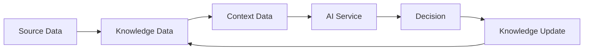

# 007 数据架构（Data Architecture）

> **文档编号：** 007  
> **架构视图：** Logical Data Architecture  
> **状态：** Draft  
> **版本：** v0.1.0  
> **最后更新：** 2026-07-29

---

# 1. 文档目的

本文档定义 DecisionOS 的数据架构，描述平台如何组织、管理和流转企业数据。

本文档回答以下问题：

> **DecisionOS 的数据如何组织？数据之间如何关联？数据如何在系统中流转？**

本文档关注**逻辑数据架构（Logical Data Architecture）**，而不是具体数据库或存储技术。

---

# 2. 设计目标

DecisionOS 的数据架构遵循以下目标：

- Context First（上下文优先）
- Knowledge Centric（知识中心）
- Evidence Driven（证据驱动）
- Source of Truth（事实唯一来源）
- Runtime Stateless（运行时无状态）
- Data Traceability（数据可追溯）

---

# 3. 数据分层

DecisionOS 将数据划分为四个逻辑层。

```text
┌─────────────────────────────────────┐
│            Runtime Data             │
│ Context Session                     │
│ Prompt                              │
│ AI Response                         │
│ Tool Call                           │
│ Trace                               │
└─────────────────────────────────────┘
                  ▲
┌─────────────────────────────────────┐
│            Context Data             │
│ Aggregated Context                  │
│ Evidence Set                        │
│ Business Context                    │
└─────────────────────────────────────┘
                  ▲
┌─────────────────────────────────────┐
│           Knowledge Data            │
│ Meeting                             │
│ Decision                            │
│ Project                             │
│ Task                                │
│ Document                            │
│ Customer                            │
│ Person                              │
│ Organization                        │
└─────────────────────────────────────┘
                  ▲
┌─────────────────────────────────────┐
│            Source Data              │
│ ERP                                │
│ CRM                                │
│ OA                                 │
│ HR                                 │
│ Git                                │
│ Wiki                               │
└─────────────────────────────────────┘
```

每一层具有独立职责，并通过明确的数据流进行连接。

---

# 4. 数据层说明

## 4.1 Source Data（源数据）

Source Data 指企业已有业务系统中的原始数据。

例如：

- ERP
- CRM
- OA
- HR
- Git
- Wiki
- 第三方业务系统

特点：

- DecisionOS 不拥有数据所有权。
- DecisionOS 不修改源数据。
- DecisionOS 仅负责接入、同步和引用。

---

## 4.2 Knowledge Data（知识数据）

Knowledge Data 是经过标准化后的企业知识对象。

典型对象包括：

- Meeting
- Decision
- Project
- Task
- Document
- Customer
- Person
- Organization

特点：

- 长期保存。
- 可建立关联关系。
- 支持全文检索与语义检索。
- 构成企业知识资产。

Knowledge Data 是 DecisionOS 的核心长期数据。

---

## 4.3 Context Data（上下文数据）

Context Data 并不是新的业务对象，而是运行期间根据多个知识对象动态聚合形成。

例如：

```text
Meeting
     │
Decision
     │
Task
     │
Document
     │
Customer
──────────────
        ↓
Business Context
```

特点：

- 动态生成。
- 可重复构建。
- 不作为事实来源。
- 面向 AI 推理。

Context 是 DecisionOS 的核心能力。

---

## 4.4 Runtime Data（运行时数据）

Runtime Data 是一次请求生命周期内产生的数据。

例如：

- Context Session
- Prompt
- Tool Call
- LLM Response
- Token Usage
- Trace
- Event

特点：

- 生命周期短。
- 默认不长期保存。
- 支持日志与审计。

---

# 5. 数据生命周期

DecisionOS 的数据在系统中不断演化。

```text
Source Data
      │
      ▼
Knowledge Objects
      │
      ▼
Context Engine
      │
      ▼
Business Context
      │
      ▼
AI Analysis
      │
      ▼
Decision
      │
      ▼
Knowledge Update
```

说明：

1. 企业业务系统提供原始事实。
2. DecisionOS 将事实组织为知识对象。
3. Context Engine 聚合形成业务上下文。
4. AI 基于 Context 完成推理。
5. 决策结果重新沉淀为新的知识对象。

整个系统形成持续演进的知识闭环。

---

# 6. 数据所有权

DecisionOS 明确区分数据所有权。

| 数据 | Owner |
|------|--------|
| ERP 数据 | ERP |
| CRM 数据 | CRM |
| OA 数据 | OA |
| Meeting | DecisionOS |
| Decision | DecisionOS |
| Project | DecisionOS |
| Task | DecisionOS |
| Context | Runtime |
| AI Response | Runtime（可配置持久化） |
| Evidence | DecisionOS |

DecisionOS 不拥有企业源系统数据，只拥有自身生成的知识资产。

---

# 7. 数据流

运行过程中主要存在以下数据流。



该流程体现了知识持续积累与演进。

---

# 8. 数据一致性原则

DecisionOS 遵循以下原则。

## Single Source of Truth

事实数据始终来源于权威业务系统。

---

## Immutable Evidence

Evidence 一经生成，不应被修改。

---

## Rebuildable Context

Context 应可根据事实重新构建。

---

## Traceable Decision

每项决策应能够追溯：

- Facts
- Context
- Evidence
- AI Recommendation

---

## Runtime Isolation

每个 Context Session 相互隔离。

不同请求之间不得共享运行时状态。

---

# 9. 数据治理

DecisionOS 支持统一的数据治理。

包括：

- Metadata Management（元数据管理）
- Version Control（版本管理）
- Retention Policy（数据保留策略）
- Access Control（访问控制）
- Audit Trail（审计日志）
- Data Lineage（数据血缘）

数据治理能力贯穿整个数据生命周期。

---

# 10. 不在本文档讨论范围

本文档不涉及：

- PostgreSQL 表结构
- Elasticsearch 索引设计
- Vector Database
- Graph Database
- 对象存储实现
- API 设计
- ORM 模型

这些内容将在后续文档中说明。

---

# 11. 关联文档

- 003_Context_Engine.md
- 004_System_Context.md
- 005_System_Architecture.md
- 006_Runtime_Architecture.md
- Knowledge Object Model

---

# 修订记录

| 版本 | 日期 | 内容 |
|------|------|------|
| v0.1.0 | 2026-07-29 | 初始版本 |